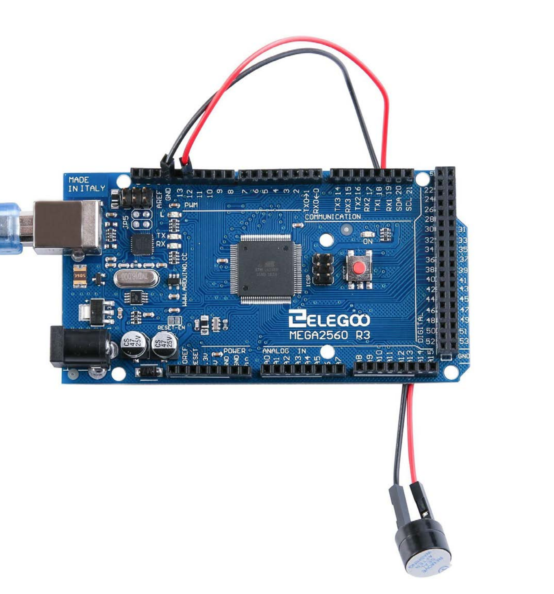

# Passive buzzer

## Código

Para realizar el ejercicio del zumbador, modifiqué el código para que emitiese una melodía con notas y sus duraciones. El código de este programa es:

```
//www.elegoo.com
//2016.12.08

#include "pitches.h"

// notes in the melody:
int melody[] = {
  NOTE_C5, NOTE_E5, NOTE_C5, NOTE_F5, NOTE_C5, NOTE_E5, NOTE_D5, NOTE_C5, NOTE_F5,
  NOTE_C5, NOTE_E5, NOTE_G5, NOTE_C6, NOTE_G5, NOTE_A5, NOTE_G5, NOTE_F5, NOTE_D6,};
int duration[] = {
  100, 300, 100, 300, 100, 75, 75, 75, 300,
  100, 300, 100, 300, 100, 75, 75, 75 ,300};  // 500 miliseconds

void setup() {

}

void loop() {
  for (int i = 0; i < 18; i++) {
    // pin8 output the voice, every scale is 0.5 sencond
    tone(8, melody[i]);

    // Output the voice after several minutes
    delay(duration[i]*2);
    noTone(8);
  }

  // restart after two seconds
  delay(2000);
}

```

## Circuito

El circuito está montado tal cual se especificaba en la guía de la placa, con la diferencia de la patilla a la que está conectado el zumbador que es la **número 8** en lugar de la número 12.



## Vídeo

[El vídeo con el resulado final](./passive_buzzer.mp4) puede encontrarse en el mismo zip en el que se encuentra este archivo PDF.
