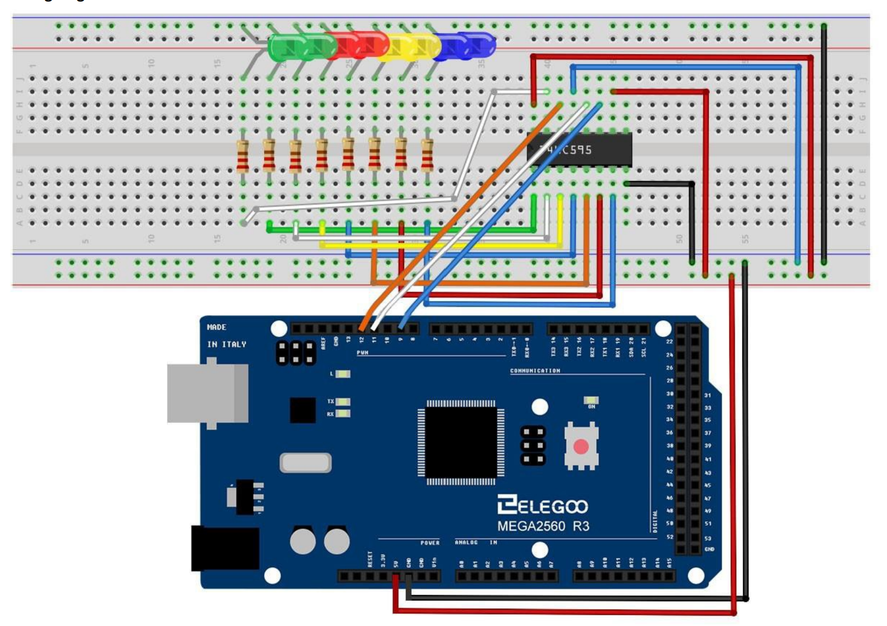
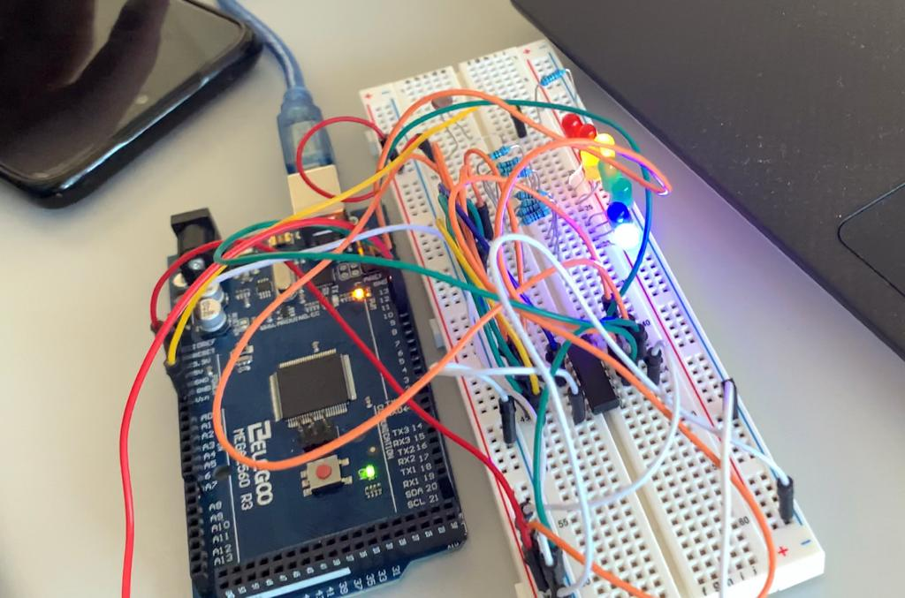

# Photocell_v2

## Codigo

Este ejercicio realiza una modificación del código de la versión 1 para añadir luces leds que indiquen el nivel de luz, además del sonido del zumbador. El código es el siguiente

```
// variable to hold sensor value
int sensorValue;
// variable to calibrate low value
int sensorLow = 1023;
// variable to calibrate high value
int sensorHigh = 0;
// LED pin
const int ledPin = 13;

int lightPin = 0;
int latchPin = 11;
int clockPin = 9;
int dataPin = 12;

int leds = 0;

void setup() {
  // Make the LED pin an output and turn it on
  pinMode(ledPin, OUTPUT);
  digitalWrite(ledPin, HIGH);

  // calibrate for the first five seconds after program runs
  while (millis() < 5000) {
    // record the maximum sensor value
    sensorValue = analogRead(A0);
    if (sensorValue > sensorHigh) {
      sensorHigh = sensorValue;
    }
    // record the minimum sensor value
    if (sensorValue < sensorLow) {
      sensorLow = sensorValue;
    }
  }
  // turn the LED off, signaling the end of the calibration period
  digitalWrite(ledPin, LOW);

  pinMode(latchPin, OUTPUT);
  pinMode(dataPin, OUTPUT);
  pinMode(clockPin, OUTPUT);
}

void updateShiftRegister()
{
   digitalWrite(latchPin, LOW);
   shiftOut(dataPin, clockPin, LSBFIRST, leds);
   digitalWrite(latchPin, HIGH);
}

void loop() {
  //read the input from A0 and store it in a variable
  sensorValue = analogRead(A0);

  // map the sensor values to a wide range of pitches
  int pitch = map(sensorValue, sensorLow, sensorHigh, 50, 4000);
  int numLEDSLit = map(sensorValue, sensorLow, sensorHigh, 0, 8);

  leds = (1 << numLEDSLit) - 1;

  // play the tone for 20 ms on pin 8
  tone(8, pitch, 20);
  updateShiftRegister();

  // wait for a moment
  delay(10);
}

```

## Circuito

El circuito está montado como una actualización del circuito de la versión 1, al que se le ha añadido un chip _"74HC595 Serial to Parallel Converter"_ y 8 luces leds. Se ha hecho siguiendo la guía de ejemplo de uso para este chip, uniendolo a lo que ya teniamos antes. El esquema de la parte que se ha añadido es el siguiente:



El circuito queda así con todos los componentes (aunque en la imagen no se acaba de ver el zumbador):



## Vídeo

[El vídeo con el resulado final](./photocell_v2.mp4) puede encontrarse en el mismo zip en el que se encuentra este archivo PDF.
